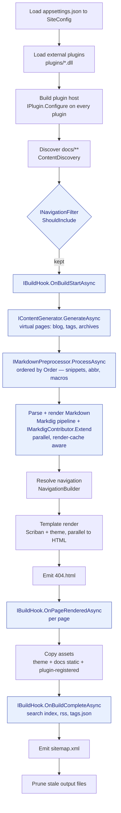
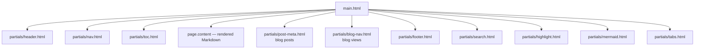

# Build lifecycle & hook order

This page is the visual reference for **where things hook into a Netdocs build**. If you
are writing a plugin or a theme override and you are not sure *when* your code runs — or
*where* in the pipeline you should hook in — start here.

Everything below is driven by
[`BuildEngine.BuildAsync`](https://github.com/XtremeOwnage/Netdocs/blob/main/src/Netdocs.Core/BuildEngine.cs),
which orchestrates one build from config to emitted HTML.

## The pipeline at a glance

The **blue** nodes are the extension points a plugin can implement. Everything else is
engine-owned.

## Ordered stages

| # | Stage | Extension point | Notes |
| --- | --- | --- | --- |
| 1 | Load configuration | — | `appsettings.json` becomes `SiteConfig`. |
| 2 | Load external plugins | *(discovery)* | `plugins/*.dll` are registered but not yet enabled. See [External plugins](external-plugins.md). |
| 3 | Configure plugins | `IPlugin.Configure` | Called **once** per enabled plugin. Register assets/scripts/services here. Runs in `appsettings.json` plugin order. |
| 4 | Discover content | — | Walks `docs/**`, honoring `.mkdocsignore` / `exclude`. |
| 5 | Navigation filters | `INavigationFilter.ShouldInclude` | A page is kept only if **all** filters return `true`. |
| 6 | Build start | `IBuildHook.OnBuildStartAsync` | First async hook. The full (filtered) page set is on `site.Pages`. |
| 7 | Content generation | `IContentGenerator.GenerateAsync` | Emit virtual pages (blog lists, tag pages). Generated pages join `site.Pages`. |
| 8 | Preprocess Markdown | `IMarkdownPreprocessor.ProcessAsync` | Runs **in ascending `Order`** for every page (including generated). Text-in/text-out. |
| 9 | Parse + render | `IMarkdigContributor.Extend` | Markdig extensions are contributed once; pages render in parallel and results are cached by content hash. |
| 10 | Resolve navigation | — | Builds the nav tree used by templates. |
| 11 | Template render | *(theme templates)* | Scriban renders each page (parallel) to HTML. See [Template render order](#template-render-order). |
| 12 | 404 page | *(theme templates)* | `404.html` is rendered if the theme provides it. |
| 13 | Page rendered | `IBuildHook.OnPageRenderedAsync` | Called for every page after HTML is written. Good for indexing (search). |
| 14 | Copy assets | `IPluginContext.AddAsset` | Theme assets, `docs/` static files, and plugin-registered assets are copied. |
| 15 | Build complete | `IBuildHook.OnBuildCompleteAsync` | Last hook. Emit whole-site artifacts (search index, RSS, tag exports, social cards). |
| 16 | Sitemap | — | Built-in `sitemap.xml`. |
| 17 | Prune | — | Removes output files this build did not (re)produce. |

### Preprocessor ordering

Preprocessors are sorted by their `Order` property (ascending). The built-ins use:

| Order | Preprocessor | Why |
| --- | --- | --- |
| 10 | `snippets` | Expand `--8<--` includes first so later steps see the full text. |
| 20 | `table-reader` / `abbreviations` | Operate on already-included content. |
| 25 | `macros` | Runs after snippets/table-reader so their output can contain macros. |

Pick an `Order` relative to these when you need your preprocessor to run before or after
a built-in.

## Template render order

Stage 11 renders each page with [Scriban](https://github.com/scriban/scriban). The theme's
`main.html` is the root layout; it pulls in partials in roughly this order:

To override any of these, point `theme.custom_dir` at a folder of **Scriban** templates
that mirror the theme layout. (Material's Jinja2 overrides are detected and ignored.) See
[Theme reference](../reference/theme.md).

## Choosing where to hook

| I want to… | Implement | Runs at |
| --- | --- | --- |
| Register CSS/JS/assets or read options | `IPlugin.Configure` | Stage 3 |
| Include/exclude pages | `INavigationFilter` | Stage 5 |
| Do setup once the page set is known | `IBuildHook.OnBuildStartAsync` | Stage 6 |
| Create new pages | `IContentGenerator` | Stage 7 |
| Rewrite Markdown text | `IMarkdownPreprocessor` | Stage 8 |
| Add Markdown syntax/extensions | `IMarkdigContributor` | Stage 9 |
| React to each rendered page | `IBuildHook.OnPageRenderedAsync` | Stage 13 |
| Emit a whole-site artifact | `IBuildHook.OnBuildCompleteAsync` | Stage 15 |

See the [Events & callbacks reference](events-and-callbacks.md) for the exact method
signatures and examples.
