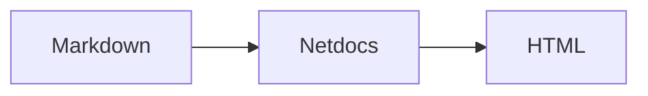

# Code blocks

Fenced code blocks are always available — no plugin or configuration is required. This page
shows every supported feature **rendered live** next to the Markdown that produces it, so you
can copy the exact syntax you need. Netdocs parses the same
[`pymdownx.highlight`](https://facelessuser.github.io/pymdown-extensions/extensions/highlight/)
fence options the MkDocs Material sites rely on, so most existing Markdown works unchanged.

Syntax highlighting is applied in the browser, and it is **scheme-aware**: token colors are
mapped onto the theme's palette so code stays legible in both light and dark mode.

## Basic block

Wrap code in a triple-backtick fence and name the language after the opening fence. The language
sets the syntax highlighting and is echoed onto the `<code>` element as `language-<name>`.

````markdown
```python
def greet(name: str) -> str:
    return f"Hello, {name}!"
```
````

```python
def greet(name: str) -> str:
    return f"Hello, {name}!"
```

A fence with no language is rendered as a plain, un-highlighted block:

````markdown
```
$ netdocs build
```
````

```
$ netdocs build
```

## Copy button

Every code block gets a **copy-to-clipboard** button in its top-right corner (the
`content.code.copy` theme feature, enabled by default). Hover a block to reveal it. Nothing extra
is required in your Markdown.

## Adding a title

Add `title="…"` to the fence to render a filename/label bar above the block. This is ideal for
showing which file a snippet belongs to.

````markdown
```yaml title="appsettings.json"
Netdocs:
  siteName: "My Site"
  theme:
    name: material
```
````

```yaml title="appsettings.json"
Netdocs:
  siteName: "My Site"
  theme:
    name: material
```

## Line numbers

Add `linenums="1"` to number the lines, starting from the value you provide (so you can match an
excerpt to its position in a larger file).

````markdown
```python linenums="1"
def factorial(n):
    if n <= 1:
        return 1
    return n * factorial(n - 1)
```
````

```python linenums="1"
def factorial(n):
    if n <= 1:
        return 1
    return n * factorial(n - 1)
```

Start numbering from an arbitrary line with `linenums="42"`:

````markdown
```python linenums="42"
    return n * factorial(n - 1)
```
````

```python linenums="42"
    return n * factorial(n - 1)
```

## Highlighting lines

Use `hl_lines="…"` to draw attention to specific lines. Line numbers here are **relative to the
block** (line 1 is the first line of the fence, regardless of `linenums`). Accepts individual
lines and ranges.

````markdown
```python hl_lines="2 3"
def factorial(n):
    if n <= 1:
        return 1
    return n * factorial(n - 1)
```
````

```python hl_lines="2 3"
def factorial(n):
    if n <= 1:
        return 1
    return n * factorial(n - 1)
```

Ranges use a hyphen, and you can mix ranges with single lines — `hl_lines="1 3-4"`:

````markdown
```python linenums="1" hl_lines="1 3-4"
def factorial(n):
    if n <= 1:
        return 1
    return n * factorial(n - 1)
```
````

```python linenums="1" hl_lines="1 3-4"
def factorial(n):
    if n <= 1:
        return 1
    return n * factorial(n - 1)
```

## Combining options

Options can be combined in any order on the same fence:

````markdown
```python title="factorial.py" linenums="1" hl_lines="2 3"
def factorial(n):
    if n <= 1:
        return 1
    return n * factorial(n - 1)
```
````

```python title="factorial.py" linenums="1" hl_lines="2 3"
def factorial(n):
    if n <= 1:
        return 1
    return n * factorial(n - 1)
```

### Brace (attr-list) form

The `pymdownx.highlight` brace form is also accepted, so Markdown authored for MkDocs Material
keeps working. The language is written as a leading `.class`:

````markdown
```{.python title="factorial.py" hl_lines="2 3"}
def factorial(n):
    if n <= 1:
        return 1
    return n * factorial(n - 1)
```
````

## Inline code highlighting

Highlight a short inline snippet by starting an inline code span with a `#!` shebang followed by
the language (the `pymdownx.inlinehilite` shebang syntax). For example,
`` `#!python range(10)` `` renders as #!python range(10), while a plain `` `range(10)` ``
stays un-highlighted.

## Mermaid diagrams

A fence tagged `mermaid` is emitted as a diagram container and rendered in the browser by
[Mermaid](https://mermaid.js.org/) — see the [Mermaid diagrams](markdown-extensions.md) notes for
details.

````markdown

````


## Supported fence options

| Option              | Example                 | Effect                                                        |
| ------------------- | ----------------------- | ------------------------------------------------------------- |
| *language*          | ` ```python `           | Sets syntax highlighting (`language-<name>` on `<code>`).     |
| `title="…"`         | `title="app.py"`        | Renders a filename/label bar above the block.                 |
| `linenums="N"`      | `linenums="1"`          | Numbers lines starting from `N`.                              |
| `hl_lines="…"`      | `hl_lines="2 4-6"`      | Highlights lines (block-relative), single lines and ranges.   |
| brace form          | ` ```{.python …} `      | `pymdownx.highlight` attr-list syntax for the same options.   |
| `#!lang` (inline)   | `` `#!python range()` `` | Highlights an inline code span (`pymdownx.inlinehilite`).     |
| `mermaid`           | ` ```mermaid `          | Renders the fence as a Mermaid diagram.                       |
