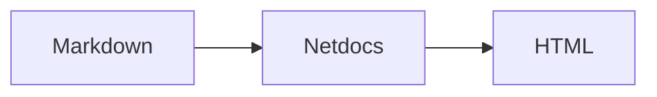
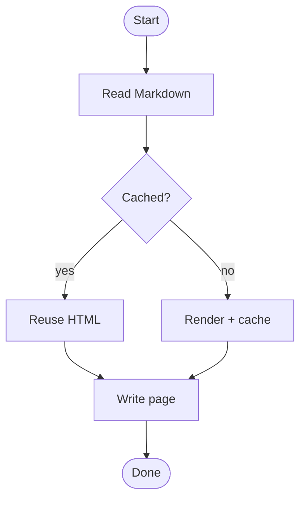
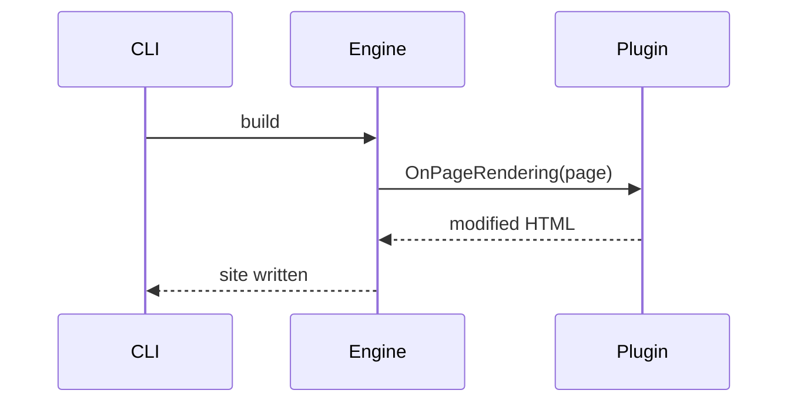
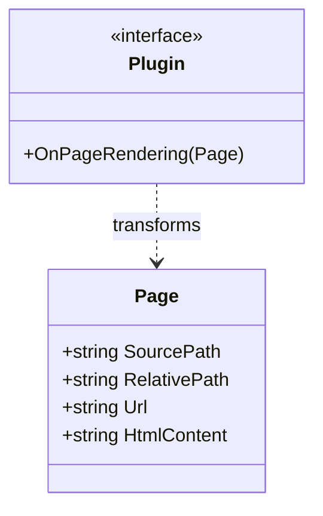
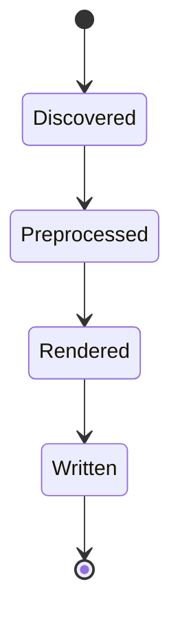
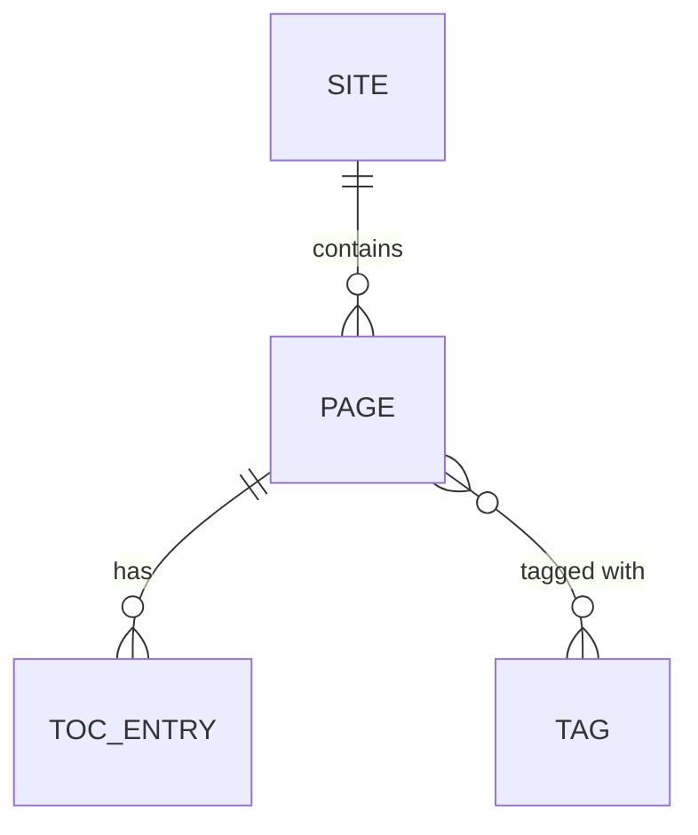
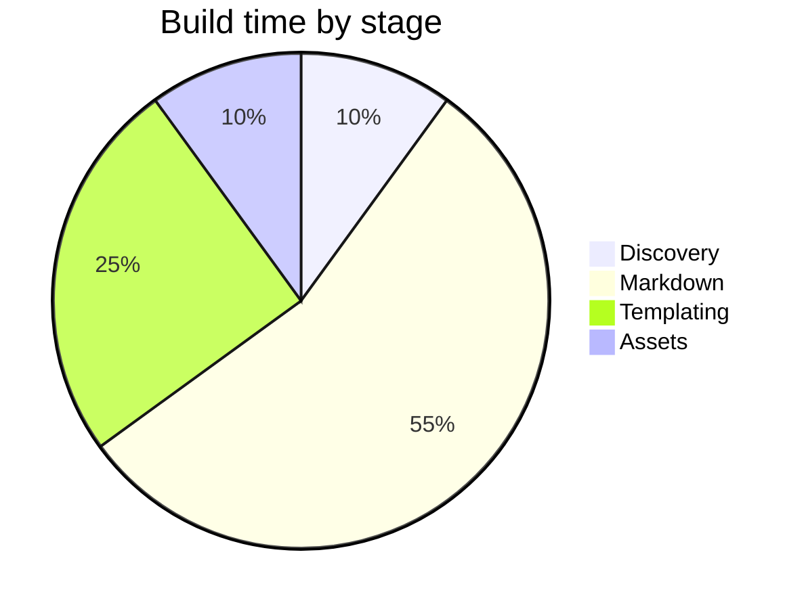
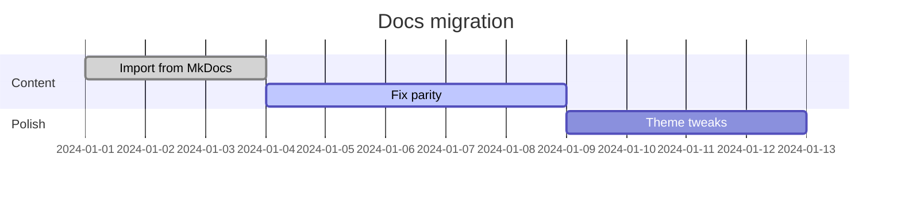

# Mermaid diagrams

Netdocs renders [Mermaid](https://mermaid.js.org/) diagrams from fenced code blocks. A fence
tagged `mermaid` is emitted server-side as a `<pre class="mermaid">` container; the theme lazy-loads
the Mermaid runtime in the browser (only when a diagram is present) and re-renders on every page
load, including Material's instant-navigation swaps.

## How it works

Write a fence with the `mermaid` info string and put a valid Mermaid definition inside:

````markdown

````

Renders as:


There is nothing to install and no plugin to enable — Mermaid support is built into the fence
parser. The runtime is fetched from a pinned jsDelivr CDN (`mermaid@11`) the first time a page
contains a diagram, so pages without diagrams load nothing extra.

!!! tip "Offline / air-gapped builds"
    The runtime loads from a CDN by default. If you need fully offline pages, vendor the Mermaid
    ESM bundle and point the theme's `partials/mermaid.html` import at your local copy.

## Diagram types

The following are the most common Mermaid diagram types. Each shows the Markdown source and the
live result. See the [Mermaid docs](https://mermaid.js.org/intro/) for the full syntax of each.

### Flowchart

````markdown

````

Renders as:


### Sequence diagram

````markdown

````

Renders as:


### Class diagram

````markdown

````

Renders as:


### State diagram

````markdown

````

Renders as:


### Entity relationship diagram

````markdown

````

Renders as:


### Pie chart

````markdown

````

Renders as:


### Gantt chart

````markdown

````

Renders as:


## Tips

- **Keep definitions valid.** If a diagram fails to parse, Mermaid silently leaves the source
  visible rather than breaking the page.
- **Indentation matters** for some diagram types (e.g. `pie`, `gantt`); use spaces, not tabs.
- **Theming.** Mermaid initializes with `startOnLoad: false` and Netdocs drives rendering itself.
  To customize colors, edit `partials/mermaid.html` and pass a `theme`/`themeVariables` object to
  `mermaid.initialize(...)`.

See also the [Code blocks](code-blocks.md) reference for the full list of fence options.
