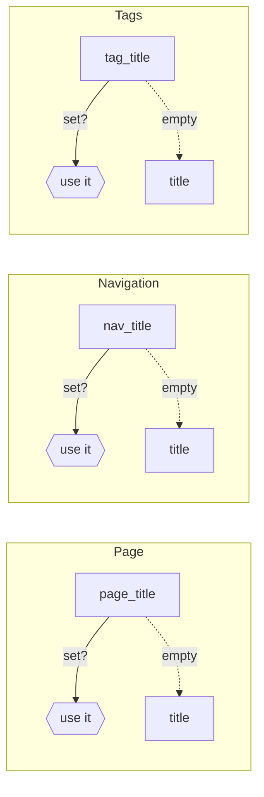

# Page metadata

Every content page can begin with a **YAML front-matter** block — a fenced `---` section at
the very top of the file. Netdocs reads a handful of keys from it to control how the page is
titled, described, iconified, and grouped.

```markdown
---
title: Configuring single sign-on for AWS IAM
page_title: SSO setup guide
nav_title: SSO
tag_title: AWS IAM SSO
description: How to wire up SSO roles for the AWS IAM account.
icon: material/key
tags:
  - aws
---

# Configuring SSO

...
```

## Title overrides

A single page is referred to in **three** different places, and each one has different space
and phrasing needs:

- the **page itself** — the browser tab / `<title>`, social cards, and “previous / next” links;
- the **navigation** — the sidebar and tab bar, where long titles wrap and look cluttered;
- the **tags listing** — where a page appears under each of its tags.

Rather than compromise on one title for all three, Netdocs lets you tune each independently.

| Front-matter key | Controls | Falls back to |
|---|---|---|
| `title` | The **standard title** used everywhere unless overridden. Derived from the first `# H1` (or the filename) when omitted. | — |
| `page_title` | The page’s own `<title>` element, `og:title` / `twitter:title`, header topic, and prev/next labels. | `title` |
| `nav_title` | The label shown in the navigation sidebar and tabs. | `title` |
| `tag_title` | The label shown for the page on the tags listing page. | `title` |

Each override is optional. When a key is absent (or blank), that surface simply uses the
standard `title`. The page’s visible `# H1` heading is **not** affected by any of these — it
always comes from the Markdown body.

!!! tip "Keep navigation short"
    A common pattern is a descriptive `title` for search and the page heading, plus a terse
    `nav_title` so the sidebar stays scannable:

    ```yaml
    ---
    title: Team resource tagging policy (end-user guide)
    nav_title: Resource Tagging
    ---
    ```

### Resolution order



The navigation label can still be overridden a second time by an explicit `title` on the
matching entry in your `nav` configuration — a config `nav` title always wins over
`nav_title` front matter, which in turn wins over the standard `title`.

## Other common keys

| Key | Purpose |
|---|---|
| `description` | Page summary used for `meta description` and social cards. Falls back to the site description. |
| `icon` | Navigation icon for the page (any bundled icon name, e.g. `material/key`). |
| `tags` | List of tags; collected by the [tags plugin](../plugins/tags.md). |
| `template` | Render the page with a different theme template. |
| `hide` | Awesome-pages style `hide: true` drops a folder/page from the nav. |

!!! note "Directory-wide defaults"
    Repeating the same front matter on every page gets tedious. The
    [meta plugin](../plugins/meta.md) applies per-directory defaults from a `.meta.yml`
    file, and any page can still override an inherited value in its own front matter.
