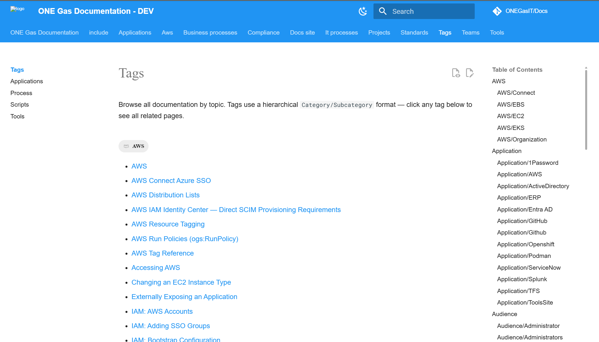

I really like the tags layout, and do want to retain this.

However, I would like a bit more functionality. I should be able to more easily control the name displayed for a post/page, on the tags page...

Custom metadata is fine for this.